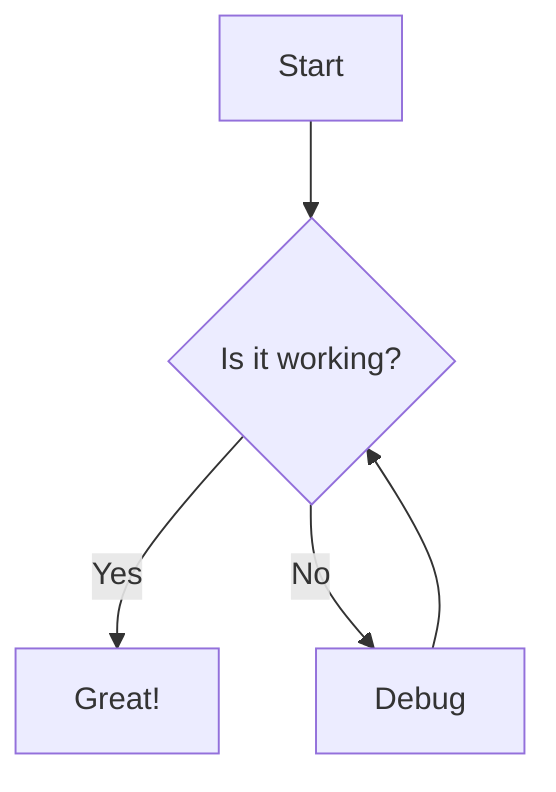
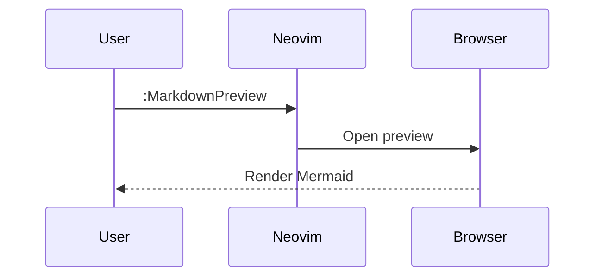

## title
heej

## Flowchart

```mermaid
flowchart TD
    A[Start] --> B{Is it working?}
    B -->|Yes| C[Great!]
    B -->|No| D[Debug]
    D --> B
```

## Sequence Diagram

```mermaid
sequenceDiagram
    participant User
    participant Neovim
    participant Browser
    User->>Neovim: :MarkdownPreview
    Neovim->>Browser: Open preview
    Browser-->>User: Render Mermaid
```
